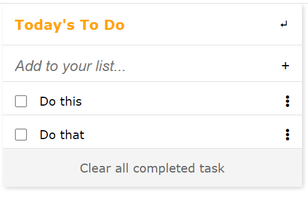

# To-Do List

> This project allows users to persist their scheduled to-do tasks in the browser

## Built With

- HTML, CSS and JavaScript
- Webpack

## Getting Started

### Setup

#### To get a local copy up and running follow these simple example steps.

- Click the green `Code` button on the repo
- In your local PC, open your terminal in the folder you would like to clone the project.
- Clone the repo with the command: `git clone (copied link)`; like so: `git clone https://github.com/TedLivist/to-do-list.git`
- On the terminal, navigate into the directory like so: `cd to-do-list`
- Checkout to branch name like so: `git checkout [branch name]`
- Run `npm i` to install the dependencies
- Run `npm start` to start the application

## Author

👤 **Teddy-Livingstone**

- [GitHub](https://github.com/TedLivist)
- [LinkedIn](https://linkedin.com/in/tememandu)

## 🤝 Contributing

Contributions, issues, and feature requests are welcome!

Feel free to check the [issues page](../../issues/).

## Show your support

Give a ⭐️ if you like this project!

## Acknowledgments

- Hat tip to anyone whose code was used
- Inspiration
- etc